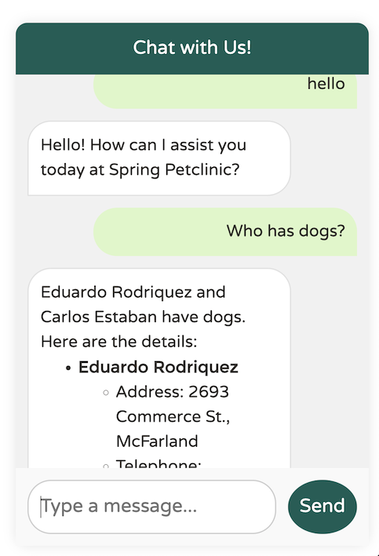
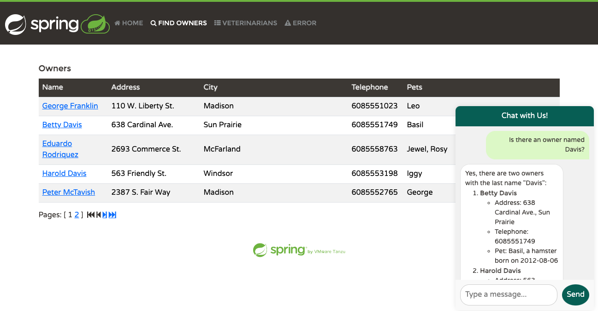

# Spring PetClinic Sample Application [](https://github.com/spring-petclinic/spring-petclinic-ai/actions/workflows/maven-build.yml)

[](https://gitpod.io/#https://github.com/spring-projects/spring-petclinic) [](https://github.com/codespaces/new?hide_repo_select=true&ref=main&repo=7517918)

## Understanding the Spring Petclinic AI application

Thanks to the work of [Oded Shopen](https://github.com/odedia), a chatbot using **Generative AI** has been added to the famous Spring Petclinic application.
This fork uses the **[Spring AI project](https://spring.io/projects/spring-ai)** and currently supports **OpenAI** or **Azure's OpenAI** as the **LLM provider**. This is a fork from the `spring-ai` branch of the `spring-petclinic` repo available [here](https://github.com/spring-projects/spring-petclinic/tree/spring-ai).

Oded described his approach in those 2 blog posts: 
* [AI Meets Spring Petclinic: Implementing an AI Assistant with Spring AI (Part I)](https://spring.io/blog/2024/09/26/ai-meets-spring-petclinic-implementing-an-ai-assistant-with-spring-ai-part-i)
* [AI Meets Spring Petclinic: Implementing an AI Assistant with Spring AI (Part II)](https://spring.io/blog/2024/09/27/ai-meets-spring-petclinic-implementing-an-ai-assistant-with-spring-ai-part)

Spring Petclinic integrates a Chatbot that allows you to interact with the application in a natural language. Here are **some examples** of what you could ask:

1. Please list the owners that come to the clinic.
2. How many vets are there?
3. Is there an owner named Betty?
4. Which owners have dogs?
5. Add a dog for Betty. Its name is Moopsie.



Spring Petclinic currently supports **OpenAI** or **Azure's OpenAI** as the LLM provider.
In order to start `spring-petlinic-springai` perform the following steps:

1. Decide which provider you want to use. By default, the `spring-ai-openai-spring-boot-starter` dependency is enabled. You can change it to `spring-ai-azure-openai-spring-boot-starter`in either`pom.xml` or in `build.gradle`, depending on your build tool of choice.
2. Create an OpenAI API key or a Azure OpenAI resource in your Azure Portal. Refer to the [OpenAI's quickstart](https://platform.openai.com/docs/quickstart) or [Azure's documentation](https://learn.microsoft.com/en-us/azure/ai-services/openai/) for further information on how to obtain these. You only need to populate the provider you're using - either openai, or azure-openai.
3. Export your API keys and endpoint as environment variables:
   * either OpenAI:
    ```bash
    export OPENAI_API_KEY="your_api_key_here"
    ```
   * or OpenAI:
    ```bash
    export AZURE_OPENAI_ENDPOINT="https://your_resource.openai.azure.com"
    export AZURE_OPENAI_KEY="your_api_key_here"
    ```
4. Follow the [next section Run Petclinic locally](#run-petclinic-locally)

## Run Petclinic locally

Spring Petclinic is a [Spring Boot](https://spring.io/guides/gs/spring-boot) application built using [Maven](https://spring.io/guides/gs/maven/) or [Gradle](https://spring.io/guides/gs/gradle/). You can build a jar file and run it from the command line (it should work just as well with Java 17 or newer):

```bash
git clone https://github.com/spring-petclinic/spring-petclinic-ai.git
cd spring-petclinic
./mvnw package
java -jar target/*.jar
```

You can then access the Petclinic at <http://localhost:8080/>.



Or you can run it from Maven directly using the Spring Boot Maven plugin. If you do this, it will pick up changes that you make in the project immediately (changes to Java source files require a compile as well - most people use an IDE for this):

```bash
./mvnw spring-boot:run
```

> NOTE: If you prefer to use Gradle, you can build the app using `./gradlew build` and look for the jar file in `build/libs`.

## Building a Container

There is no `Dockerfile` in this project. You can build a container image (if you have a docker daemon) using the Spring Boot build plugin:

```bash
./mvnw spring-boot:build-image
```

## In case you find a bug/suggested improvement for Spring Petclinic

Our issue tracker is available [here](https://github.com/spring-projects/spring-petclinic/issues).

## Database configuration

In its default configuration, Petclinic uses an in-memory database (H2) which
gets populated at startup with data. The h2 console is exposed at `http://localhost:8080/h2-console`,
and it is possible to inspect the content of the database using the `jdbc:h2:mem:<uuid>` URL. The UUID is printed at startup to the console.

A similar setup is provided for MySQL and PostgreSQL if a persistent database configuration is needed. Note that whenever the database type changes, the app needs to run with a different profile: `spring.profiles.active=mysql` for MySQL or `spring.profiles.active=postgres` for PostgreSQL. See the [Spring Boot documentation](https://docs.spring.io/spring-boot/how-to/properties-and-configuration.html#howto.properties-and-configuration.set-active-spring-profiles) for more detail on how to set the active profile.

You can start MySQL or PostgreSQL locally with whatever installer works for your OS or use docker:

```bash
docker run -e MYSQL_USER=petclinic -e MYSQL_PASSWORD=petclinic -e MYSQL_ROOT_PASSWORD=root -e MYSQL_DATABASE=petclinic -p 3306:3306 mysql:8.4
```

or

```bash
docker run -e POSTGRES_USER=petclinic -e POSTGRES_PASSWORD=petclinic -e POSTGRES_DB=petclinic -p 5432:5432 postgres:16.3
```

Further documentation is provided for [MySQL](https://github.com/spring-projects/spring-petclinic/blob/main/src/main/resources/db/mysql/petclinic_db_setup_mysql.txt)
and [PostgreSQL](https://github.com/spring-projects/spring-petclinic/blob/main/src/main/resources/db/postgres/petclinic_db_setup_postgres.txt).

Instead of vanilla `docker` you can also use the provided `docker-compose.yml` file to start the database containers. Each one has a profile just like the Spring profile:

```bash
docker-compose --profile mysql up
```

or

```bash
docker-compose --profile postgres up
```

## Test Applications

At development time we recommend you use the test applications set up as `main()` methods in `PetClinicIntegrationTests` (using the default H2 database and also adding Spring Boot Devtools), `MySqlTestApplication` and `PostgresIntegrationTests`. These are set up so that you can run the apps in your IDE to get fast feedback and also run the same classes as integration tests against the respective database. The MySql integration tests use Testcontainers to start the database in a Docker container, and the Postgres tests use Docker Compose to do the same thing.

## Compiling the CSS

There is a `petclinic.css` in `src/main/resources/static/resources/css`. It was generated from the `petclinic.scss` source, combined with the [Bootstrap](https://getbootstrap.com/) library. If you make changes to the `scss`, or upgrade Bootstrap, you will need to re-compile the CSS resources using the Maven profile "css", i.e. `./mvnw package -P css`. There is no build profile for Gradle to compile the CSS.

## Working with Petclinic in your IDE

### Prerequisites

The following items should be installed in your system:

- Java 17 or newer (full JDK, not a JRE)
- [Git command line tool](https://help.github.com/articles/set-up-git)
- Your preferred IDE
  - Eclipse with the m2e plugin. Note: when m2e is available, there is an m2 icon in `Help -> About` dialog. If m2e is
  not there, follow the install process [here](https://www.eclipse.org/m2e/)
  - [Spring Tools Suite](https://spring.io/tools) (STS)
  - [IntelliJ IDEA](https://www.jetbrains.com/idea/)
  - [VS Code](https://code.visualstudio.com)

### Steps

1. On the command line run:

    ```bash
    git clone https://github.com/spring-projects/spring-petclinic.git
    ```

1. Inside Eclipse or STS:

    Open the project via `File -> Import -> Maven -> Existing Maven project`, then select the root directory of the cloned repo.

    Then either build on the command line `./mvnw generate-resources` or use the Eclipse launcher (right-click on project and `Run As -> Maven install`) to generate the CSS. Run the application's main method by right-clicking on it and choosing `Run As -> Java Application`.

1. Inside IntelliJ IDEA:

    In the main menu, choose `File -> Open` and select the Petclinic [pom.xml](pom.xml). Click on the `Open` button.

    - CSS files are generated from the Maven build. You can build them on the command line `./mvnw generate-resources` or right-click on the `spring-petclinic` project then `Maven -> Generates sources and Update Folders`.

    - A run configuration named `PetClinicApplication` should have been created for you if you're using a recent Ultimate version. Otherwise, run the application by right-clicking on the `PetClinicApplication` main class and choosing `Run 'PetClinicApplication'`.

1. Navigate to the Petclinic

    Visit [http://localhost:8080](http://localhost:8080) in your browser.

## Looking for something in particular?

|Spring Boot Configuration | Class or Java property files  |
|--------------------------|---|
|The Main Class | [PetClinicApplication](https://github.com/spring-projects/spring-petclinic/blob/main/src/main/java/org/springframework/samples/petclinic/PetClinicApplication.java) |
|Properties Files | [application.properties](https://github.com/spring-projects/spring-petclinic/blob/main/src/main/resources) |
|Caching | [CacheConfiguration](https://github.com/spring-projects/spring-petclinic/blob/main/src/main/java/org/springframework/samples/petclinic/system/CacheConfiguration.java) |

## Interesting Spring Petclinic branches and forks

The Spring Petclinic "main" branch in the [spring-projects](https://github.com/spring-projects/spring-petclinic)
GitHub org is the "canonical" implementation based on Spring Boot and Thymeleaf. There are
[quite a few forks](https://spring-petclinic.github.io/docs/forks.html) in the GitHub org
[spring-petclinic](https://github.com/spring-petclinic). If you are interested in using a different technology stack to implement the Pet Clinic, please join the community there.

## Interaction with other open-source projects

One of the best parts about working on the Spring Petclinic application is that we have the opportunity to work in direct contact with many Open Source projects. We found bugs/suggested improvements on various topics such as Spring, Spring Data, Bean Validation and even Eclipse! In many cases, they've been fixed/implemented in just a few days.
Here is a list of them:

| Name | Issue |
|------|-------|
| Spring JDBC: simplify usage of NamedParameterJdbcTemplate | [SPR-10256](https://jira.springsource.org/browse/SPR-10256) and [SPR-10257](https://jira.springsource.org/browse/SPR-10257) |
| Bean Validation / Hibernate Validator: simplify Maven dependencies and backward compatibility |[HV-790](https://hibernate.atlassian.net/browse/HV-790) and [HV-792](https://hibernate.atlassian.net/browse/HV-792) |
| Spring Data: provide more flexibility when working with JPQL queries | [DATAJPA-292](https://jira.springsource.org/browse/DATAJPA-292) |

## Contributing

The [issue tracker](https://github.com/spring-projects/spring-petclinic/issues) is the preferred channel for bug reports, feature requests and submitting pull requests.

For pull requests, editor preferences are available in the [editor config](.editorconfig) for easy use in common text editors. Read more and download plugins at <https://editorconfig.org>. If you have not previously done so, please fill out and submit the [Contributor License Agreement](https://cla.pivotal.io/sign/spring).

## License

The Spring PetClinic sample application is released under version 2.0 of the [Apache License](https://www.apache.org/licenses/LICENSE-2.0).
